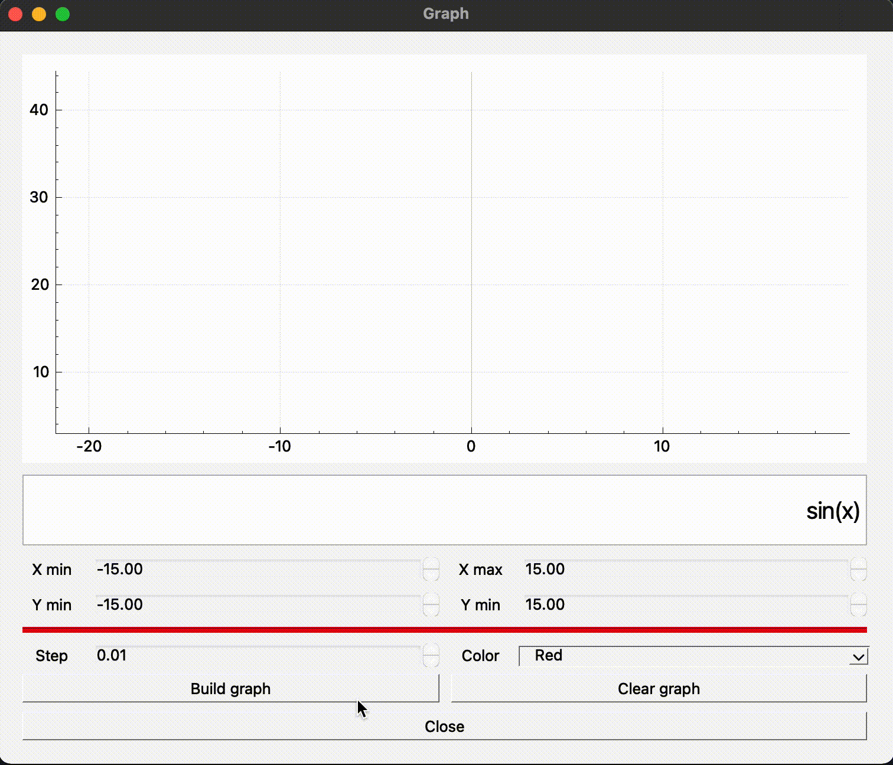

# Smart calc С++

## About project

In this project, a scientific calculator is implemented that can perform calculations with arbitrary bracket expressions, as well as calculate the expression with substitution of a number together with "x".
In addition, the construction of graphs of arbitrary mathematical expressions is implemented.
The bonus is made by a loan calculator that allows you to calculate a loan in two formats in annuity, differentiated.

## Implementation details

All calculators have a graphical interface, the code is also written using the C ++ language and built according to the MVC principle (model, view, controller). All expressions are validated and processed in the model. The project is unit tested and has full coverage.

## Math(scientific) calculator

Calculator Features

| Function description             | Function |
| -------------------------------- | -------- |
| Calculates cosine                | cos(x)   |
| Calculates the sine              | sin(x)   |
| Calculates tangent               | tan(x)   |
| Calculates the arc cosine        | acos(x)  |
| Calculates arcsine               | asin(x)  |
| Calculates arc tangent           | atan(x)  |
| Calculates the square root       | sqrt(x)  |
| Calculates the natural logarithm | log(x)   |
| Calculates the decimal logarithm | log(x)   |

## Graph

With this application, you can draw graphs with a range of definitions from -1,000,000 to 1,000,000 and a range of values ​​from -1,000,000 to 1,000,000.

## Credit calc

The loan calculator allows you to calculate a loan for different types of monthly payments: annuity and differentiated.

**Annuity** - represents equal monthly amounts throughout the entire term of the loan.

**Differentiated** - the amount of the monthly payment decreases by the end of the loan term.

The interface of the calculator is intuitive and even an inexperienced user will be able to correctly calculate his monthly payment and the final overpayment, thereby choosing the best option for himself.

## Project build instructions

On the PC should be qt 6 version. Assembly is done using cmake.
The project implemented a Makefile with targets (all, install, uninstall, clean, dvi, dist, tests)
To install the application, the command in the src directory is "make install"
